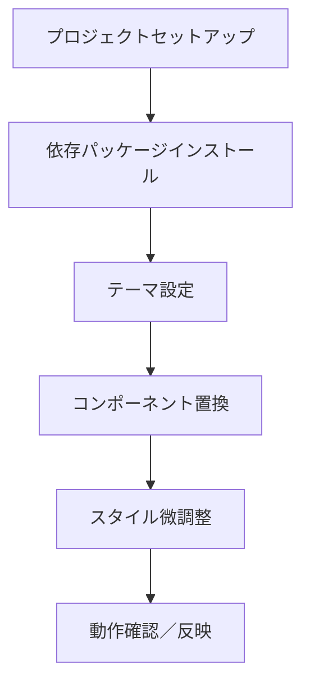

# Material UI 導入計画

以下のステップで Material UI を導入し、見た目を手早く整える計画を提案します。



## ステップ詳細

1. 依存パッケージのインストール  
   - `front` ディレクトリで以下を実行  
     ```bash
     npm install @mui/material @emotion/react @emotion/styled @mui/icons-material
     ```

2. グローバルテーマ＆ベーススタイル設定  
   - `front/src/index.js` にて:  
     - `ThemeProvider` と `CssBaseline` を読み込み  
     - 独自テーマ（カラーパレットやフォント）を定義  
     - `<App />` を `<ThemeProvider theme={customTheme}><CssBaseline /><App /></ThemeProvider>` でラップ  

3. 主要レイアウトコンポーネントへの置換  
   - `App.js` の `<div className="container">` → MUI の `<Container>`  
   - `<h1>在庫管理アプリ</h1>` → `<Typography variant="h4">在庫管理アプリ</Typography>`  
   - ナビゲーション → MUI の `AppBar` + `Toolbar` + `Button` に置き換え  

4. 各ビューの UI コンポーネント化  
   - テーブル → `Table`, `TableHead`, `TableBody`, `TableRow`, `TableCell`  
   - フォーム → `TextField`, `FormControl`, `InputLabel`, `Select`, `MenuItem`, `Button`  
   - トースト通知を MUI の `Snackbar` に置き換え（任意）  

5. カスタム CSS の見直し  
   - `App.css` はベースリセット用途のみとし不要なスタイルを削除  
   - MUI のテーマを使い `spacing`、`palette` で余白やカラーを統一  

6. 動作確認・微調整  
   - 各画面のレスポンシブ確認  
   - カラーユニフォーム化、アイコン追加、ダークモード対応など  

これで Material UI 導入のプランをまとめました。