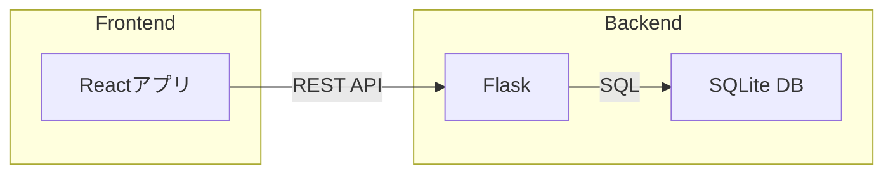

# 在庫管理アプリ 技術スタックまとめ

## バックエンド
- **言語・フレームワーク**: Python（Flask）
- **主な役割**: REST APIの提供、DB操作、業務ロジック

## データベース
- **DBMS**: SQLite
- **特徴**: シンプルでセットアップが容易、研修用途に最適

## フロントエンド
- **フレームワーク**: React
- **主な役割**: UI構築、APIとの通信、状態管理

## システム構成イメージ

---

※この技術スタックをベースに、研修用在庫管理アプリの設計・開発を進める想定です。