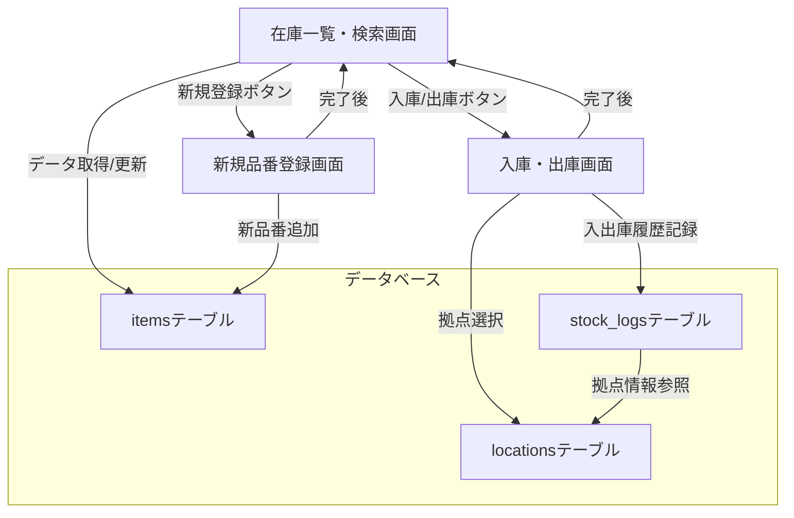

# 研修用シンプル在庫管理アプリ 設計まとめ

## 1. 画面構成
- **在庫一覧・検索画面**
  - 全在庫リスト表示
  - 検索ボックス（品番・品名などでフィルタ）
  - 「入庫」「出庫」「新規登録」ボタン

- **入庫・出庫画面**
  - 対象品番の選択
  - 数量入力
  - 入庫 or 出庫の実行

- **新規品番登録画面**
  - 品番、品名、初期在庫数の入力
  - 登録ボタン

## 2. 機能一覧
- 在庫一覧表示・検索
- 在庫の入庫（数量増加）
- 在庫の出庫（数量減少、マイナス不可）
- 新しい品番の登録

## 3. データ構造（RDBテーブルイメージ）

| テーブル名   | カラム例                                 | 説明               |
|--------------|-----------------------------------------|--------------------|
| items        | id, code, name, category                | 品番マスタ         |
| locations    | id, name                                | 拠点マスタ         |
| stock_logs   | id, item_id, location_id, type, qty, date | 入出庫履歴         |

- items: 品番ごとのカテゴリ等を管理
- locations: 拠点情報を管理
- stock_logs: 入出庫の履歴を記録（どの拠点で何があったかも記録）

## 4. システム構成イメージ（Mermaid図）

## 5. 採用した改修要望

### 品番にカテゴリ情報を追加
- itemsテーブルに「category」カラムを追加
- カテゴリでの検索・絞り込み機能追加

### 複数拠点対応
- locationsテーブル新設
- itemsテーブルとlocationsテーブルのリレーション追加
- stock_logsにも拠点情報を記録

---

※本設計まとめは研修用の参考資料です。ご要望に応じて拡張・修正が可能です。